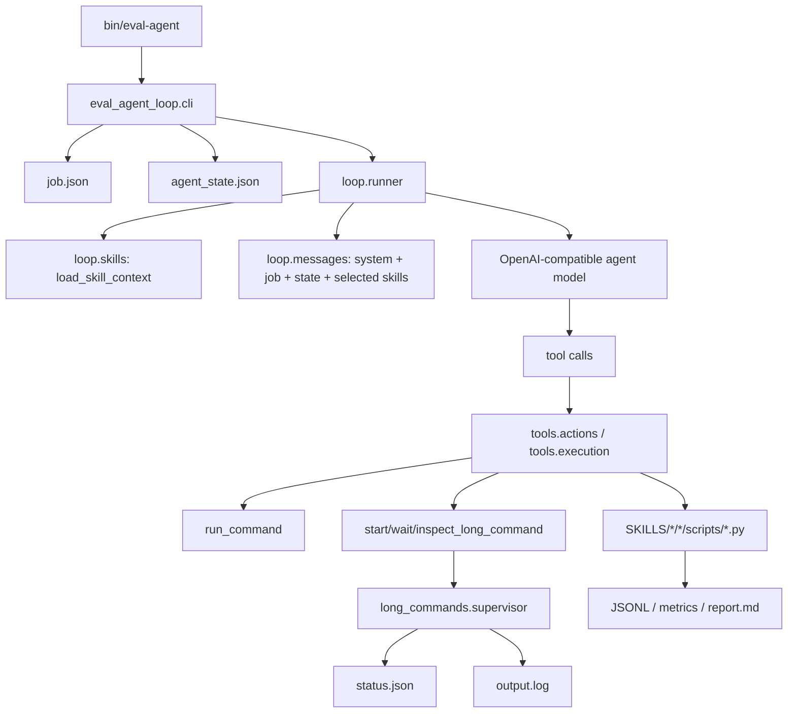

# Eval Agent Design

`eval-agent` 是一个可以通过 skill 扩展的测评 agent，实现一键式从输入模型路径到输出测评报告：由模型负责按任务编排步骤，由 agent runtime 负责提供安全、可观测、可恢复的执行环境。

它不是某个 benchmark 的固定脚本包装器。agent runtime 只提供通用执行能力，具体任务怎么推理、怎么评测、怎么解析日志和报告，由对应的 skill 定义。

## 核心目标与边界

核心目标：

- 命令行输入 agent 模型地址、checkpoint、任务名和报告目录。
- 按需加载当前任务需要的 skills，避免把所有 skill 一次性放进 prompt。
- 支持长时间推理和评测任务，包括 lmms-eval、benchmark 自带推理、vLLM 服务等。
- 真实执行命令，真实读取日志和产物，不模拟、不编造、不 mock。
- 自动把评测结果整理成报告。
- 遇到可恢复错误时让 agent 尝试修正，无法修正时再 `ask_user`。

关键边界：

- agent runtime 不包含 benchmark 专属逻辑。
- JSONL 路径提取、指标提取、报告片段生成等任务逻辑放在对应 skill 的 `scripts/` 下。
- agent 工具层只提供通用能力：命令执行、长任务管理、文件读写、状态记录、结束或询问用户。

## 总体架构



运行时代码分三层：

- `core/`：配置、OpenAI client、状态文件、路径约束、进度事件。
- `loop/`：agent loop、prompt 组装、skill 按需加载。
- `tools/`：模型可调用的通用工具，包括命令执行、文件读写、长任务管理。

唯一命令行入口是 `bin/eval-agent`，它直接调用 `eval_agent_loop.cli`。包根 `eval_agent_loop/__init__.py` 不 re-export 内部实现，避免形成隐式兼容 API。

## 一次运行的生命周期

单 checkpoint 典型启动方式：

```bash
python3 -B bin/eval-agent \
  --base-url http://127.0.0.1:6666/v1 \
  --api-key EMPTY \
  --agent-model qwen-agent \
  --checkpoint /path/to/checkpoint \
  --task omnidocbench_v1_6 \
  --report-dir results/report_$(date +%Y%m%d_%H%M%S) \
  --skills-dir SKILLS \
  --worker-cuda-visible-devices 0,1 \
  --max-iterations 50
```

CLI 负责准备运行上下文：

1. 从参数或 `--job` 构造 job。
2. 创建 `job.json`、`agent_state.json` 和报告目录。
3. 初始化 OpenAI-compatible client。
4. 调用 `run_loop`。

当未传 `--job` 时，CLI 会根据 `--checkpoint`、`--task`、`--report-dir` 生成 job。对于 `omnidocbench_v1_6`，默认 task skill 是 `omnidocbench_task`，默认 inference skill 是 `lmms-eval-old`，默认 evaluation skill 是 `omnidocbench`。

CLI 还会把本地地址加入 `NO_PROXY/no_proxy`，避免环境代理影响本机 vLLM 服务访问。对于 `lmms-eval-old`，agent 模型端口不要使用 `8000`，因为该 skill 内部默认把 `8000` 留给被评测模型的 vLLM 服务。

多个 checkpoint 建议使用 batch JSONL 串行执行：

```jsonl
{"ckp": "/path/to/checkpoint-416", "task": ["omnidocbench_v1_6"]}
{"ckp": "/path/to/checkpoint-500", "task": ["omnidocbench_v1_6", "other_task"]}
```

启动方式：

```bash
python3 -B bin/eval-agent \
  --base-url http://127.0.0.1:6666/v1 \
  --api-key EMPTY \
  --agent-model qwen-agent \
  --batch-jsonl jobs/checkpoints.jsonl \
  --report-dir results/batch_$(date +%Y%m%d_%H%M%S) \
  --skills-dir SKILLS \
  --worker-cuda-visible-devices 0,1 \
  --max-iterations 50
```

batch runner 会把每个 `ckp × task` 展开为一个独立 job，串行调用现有 agent loop。每个子任务拥有独立的 `job.json`、`agent_state.json`、`report.md` 和 `.eval_agent/commands/`，最后在 batch 根目录写出 `batch_summary.jsonl` 和 `batch_summary.md`。

## Job 与 Skill

job 是 agent 的任务契约，描述这次测评要做什么：

- `checkpoint.path`：待测模型权重。
- `task.name`：任务名，例如 `omnidocbench_v1_6`。
- `task.skill`：任务编排 skill。
- `inference.skill`：推理 skill。
- `evaluation.skill`：评测 skill。
- `outputs.root/report_path`：workspace 和最终报告路径。

skills 目录按三类组织：

```text
SKILLS/
  task/
    SKILL.md
    omnidocbench_task/SKILL.md
  inference/
    SKILL.md
    lmms-eval-old/
      SKILL.md
      scripts/extract_samples.py
  evaluation/
    SKILL.md
    omnidocbench/
      SKILL.md
      scripts/extract_metrics.py
```

三类 skill 的职责不同：

- `task`：定义任务级状态机，例如先推理再评测，什么时候可以结束。
- `inference`：定义真实推理方式，例如启动 lmms-eval 或调用 benchmark 自带推理。
- `evaluation`：定义真实评测方式，例如运行 benchmark 脚本并提取指标。

`load_skill_context` 只读取当前 job 引用到的 skill：

- 基础 category skill：`task/SKILL.md`、`inference/SKILL.md`、`evaluation/SKILL.md`
- 当前任务 skill：例如 `task/omnidocbench_task/SKILL.md`
- 当前推理 skill：例如 `inference/lmms-eval-old/SKILL.md`
- 当前评测 skill：例如 `evaluation/omnidocbench/SKILL.md`

每个被加载的 skill entry 会附带：

- `path`
- `skill_dir`
- `script_dir`

模型可以通过 `skill_context.referenced_inference_skill.script_dir` 或 `skill_context.referenced_evaluation_skill.script_dir` 调用对应 skill 的脚本。

## Agent Loop

`run_loop` 是核心循环：

1. 读取 job。
2. 按需加载 skill context。
3. 读取持久化 state/history。
4. 构造 system prompt 和 user payload。
5. 调用 agent 模型。
6. 执行模型返回的 tool calls。
7. 把结果写入 state 并追加到上下文。
8. 循环直到 `finish`、`ask_user` 或达到 `max_iterations`。

prompt 中明确要求：

- active task skill 是入口。
- 只使用当前 job 引用的 inference/evaluation skills。
- 任务相关解析和报告提取必须通过对应 skill 的 `scripts/` 完成。
- 不能模拟、伪造、mock 或编造任何产物。
- 长任务使用 `start_long_command` + `wait_long_command`。
- 恢复已有长任务使用 `inspect_long_command`。
- 同一轮返回的 tool calls 会并发执行，所以依赖步骤和抢 GPU 的步骤必须拆到不同轮。

## 工具体系

agent 暴露给模型的工具是通用能力：

- `run_command`：运行短命令，必须使用 `argv`，不接受 shell 字符串。
- `start_long_command`：启动长时间命令。
- `wait_long_command`：等待长时间命令结束，并返回状态与日志尾部。
- `inspect_long_command`：读取已持久化的长任务状态。
- `read_file`
- `write_file`
- `append_file`
- `append_event`
- `ask_user`
- `finish`

工具层不包含 `lmms`、`omnidocbench` 这类任务关键词，也不包含 `extract_lmms_eval_samples` 或 `extract_omnidocbench_metrics` 这种任务专属工具。这个边界很重要：新增 benchmark 时，只需要新增 skill 和 skill scripts，不需要修改 agent runtime。

## 长任务设计

推理和评测经常持续很久，不能用普通 blocking command 简单包住。`start_long_command` 会为每个长任务创建一个命令目录：

```text
<workspace>/.eval_agent/commands/<command_id>/
  spec.json
  status.json
  output.log
```

启动流程：

1. agent 写入 `spec.json` 和初始 `status.json`。
2. agent 启动独立 supervisor 进程。
3. supervisor 运行真实命令，把 stdout/stderr 合并写入 `output.log`。
4. supervisor 更新 `status.json`，包括 PID、returncode、signal、status、开始/结束时间。
5. agent 的 `wait_long_command` 等待状态进入 `succeeded`、`failed` 或 `cancelled`。

`wait_long_command` 返回最近 20 行 `log_tail`，避免长日志持续塞进模型上下文。完整日志路径始终保留在 `log_path` 中。

如果 agent 进程已经重启或上一次会话中断，只要知道 `command_id` 或 `metadata_path`，就可以用 `inspect_long_command` 恢复读取状态和日志尾部。

Ctrl-C 时，CLI 会调用 `cancel_active_long_commands`，对仍在当前进程登记的长任务发送终止信号，并把状态标记为 `cancelled`。

## 状态、观测与写入约束

每次工具执行都会写入 state：

```json
{
  "status": "wait_long_command",
  "history": [
    {
      "iteration": 4,
      "action": {"action": "wait_long_command"},
      "result": {"status": "succeeded"},
      "ts": "..."
    }
  ]
}
```

stderr 会输出结构化进度事件，例如：

- `agent_start`
- `context_loaded`
- `model_request`
- `model_response`
- `tool_batch_start`
- `tool_result`
- `long_command_wait`
- `agent_stop`
- `agent_error`

所有 agent 管理的写入都必须落在 workspace write root 下。默认情况下，workspace 是 `--report-dir`。

受约束的写入包括：

- state 文件
- `.eval_agent/commands/*`
- long command 日志和 metadata
- `write_file` / `append_file` / `append_event`
- skill script 写出的 Markdown 报告路径

读取真实 benchmark/log 文件不强制在 workspace 内，因为评测输入可能来自外部路径，例如服务器上的 checkpoint 或 benchmark 产物。但 agent 自己生成和管理的文件必须收敛到 report/workspace 目录，便于清理和归档。

## OmniDocBench 当前链路

`omnidocbench_v1_6` 的默认链路由 `task/omnidocbench_task` 定义：

1. 使用 `inference/lmms-eval-old` 启动 LMMS Eval 推理。
2. LMMS Eval skill 内部运行真实脚本：
   `bash scripts/evaluate_qwen3_5_vllm_agent.sh ...`
3. 脚本内部启动被测模型的 vLLM 服务并执行 lmms-eval。
4. 推理结束后，调用 `lmms-eval-old/scripts/extract_samples.py` 从真实日志中提取 samples JSONL 路径。
5. 将 JSONL 路径传给 `evaluation/omnidocbench`。
6. OmniDocBench skill 运行：
   `python pdf_validation.py --input_file=<prediction_jsonl>`
7. 评测结束后，调用 `omnidocbench/scripts/extract_metrics.py` 从真实日志中提取指标，并写入 `report.md`。
8. 所有产物真实存在后，agent 才能调用 `finish`。

这个流程里，agent runtime 不知道 OmniDocBench 指标格式，也不知道 LMMS Eval 的日志格式。它只知道如何执行命令、等待命令、传递结果、维护状态。

## 新增 Skill 的约定

新增一个 benchmark 或推理方式时，优先新增 skill，而不是改 agent runtime。

推荐结构：

```text
SKILLS/<category>/<skill-name>/
  SKILL.md
  scripts/
    parse_or_collect_artifacts.py
```

`SKILL.md` 应说明：

- 输入参数。
- 工作目录。
- 需要验证的真实文件或命令。
- 应该调用 `run_command` 还是 `start_long_command`。
- 成功条件。
- 失败时必须返回的真实信息。
- 输出产物如何给下游 skill 使用。
- 哪些解析逻辑由 `scripts/` 负责。

skill script 应该：

- 接受明确的 CLI 参数。
- 从真实日志或真实文件解析结果。
- stdout 输出 JSON。
- 失败时 stderr 输出错误并返回非零码。
- 写文件时遵守 workspace 限制。

## 关键设计取舍

### 模型负责决策，runtime 负责边界

模型决定下一步调用哪个工具、何时等待、何时进入评测、何时结束。runtime 不写死任务状态机细节，只负责验证 action、执行工具、记录状态、限制写入范围。

### Task-specific parsing 放在 skill scripts

JSONL 路径提取、指标提取、报告格式化都属于任务/benchmark 知识。如果放进 agent 工具层，后续每接一个 benchmark 都要改 runtime，agent 会退化成一堆 benchmark adapter。放到 skill scripts 后，runtime 保持稳定，skills 才是扩展点。

### 长任务用 supervisor 持久化状态

长任务不是普通函数调用。通过 supervisor、`status.json` 和 `output.log`，agent 可以把长任务变成可观察、可恢复、可取消的执行单元。即使模型上下文里只保留日志尾部，完整日志仍在磁盘上。

### 同轮工具调用可以并发，但依赖步骤必须拆轮

Qwen/OpenAI-compatible tool calls 可能在同一轮返回多个函数调用。runtime 会并发执行同轮 tool calls，所以 prompt 明确要求：依赖步骤、GPU 竞争步骤、`finish/ask_user` 都必须单独一轮。

## 后续优化

- 优化多任务测评和报告导出。
- 引入更明确的 task state schema，减少从 history 中恢复状态的成本。
- 将长任务状态更新扩展为文件事件、消息队列或 socket 事件，便于接入 Web UI。
- 接入飞书，实现自动填充实验报告。
